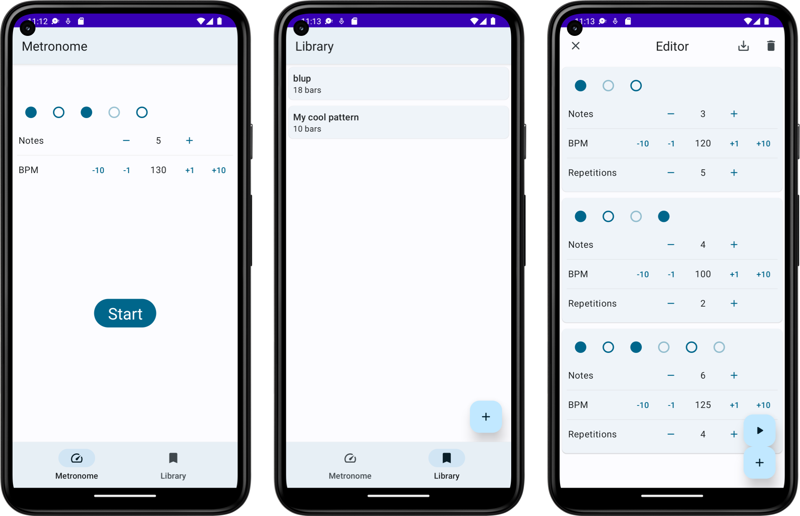

# Metronom Pro

This Android app was a project by Bastian Unterbörsch and Henrik Panhans, which was done for a university course `Mobile Applications`. Most of the project is implemented in Kotlin.
If you are interested in the documentation, which we had to hand in, please refer to the `doc` folder (spoiler: it's in German).

