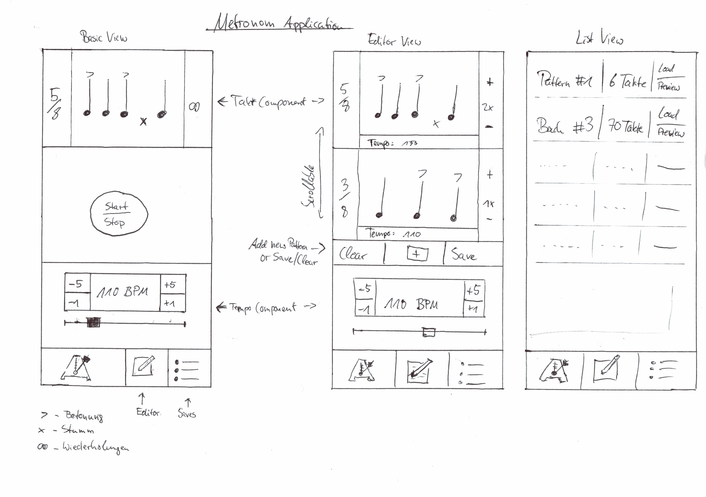

# Metronom Pro

Semesterprojekt von Bastian Unterbörsch (573228) und Henrik Panhans (573550) für das Modul "Grundlagen Mobiler Anwendungen"

## Grundidee

Wir bauen eine Metronom-App, die zusätzlich zur grundlegenden Takt-Vorgabe-Funktion noch die Möglichkeit bietet, komplexe Muster und Abfolgen von verschiedenen Takten und Tempi zu erstellen und zu speichern.
Diese Taktmuster können außerdem als QR-Code geteilt werden. Der Fokus liegt hierbei auf einer sauberen Trennung der Komponenten und möglischt präziser Zeit-Sychronisation des Metronom-Takts.

## Specs

### Views

Die App hat eine Navigation-Bar am unteren Bildschirmrand, über die die folgenden Views errreicht werden können.

#### Basic-Metronom

Diese View bietet einige Buttons zum Einstellen des Takts, Tempo und Betonung/Auslassung. Sobald der "Start"-Button gedrückt wird, spielt das Gerät einen sich wiederholenden Takt ab. Der Button wandelt sich daraufhin in einen Stop-Button um, der das Gegenteil bewirkt. Metronom halt.

#### Pro-Metronom

Das Pro-Metronom bietet die gleichen Funktionen wie das Basic-Metronom, mit dem Unterschied, dass hier nun mehrere, aufeinander folgende Takte und Beat-Muster definiert und angeordnet werden können.
Man kann diese Muster in der Reihenfolge verschieben, duplizieren, löschen oder neu hinzufügen. Es kann außerdem zu jedem Muster eine Wiederholungsanzahl angegeben und angepasst werden.
Über einen Button am oberen Bildschirmrand kann ein Menü angezeigt werden, über welches man entweder das aktuelle Beat-Muster als QR-Code teilen oder es abspeichern kann.

#### Beat-Library

Falls ein Beat-Muster vom Pro-Metronom aus abgespeichert wird, wird es daraufhin in der Beat-Library angezeigt. Von dort aus, kann man Muster antippen, die dann eine nicht-interaktive Vorschau anzeigen.
In dieser kann dann entweder auf "Abbrechen" oder "Laden" gedrückt werden, was zur Folge hat, dass das Pro-Metronom mit dem ausgewählten Muster überschrieben wird.

#### Mockups

