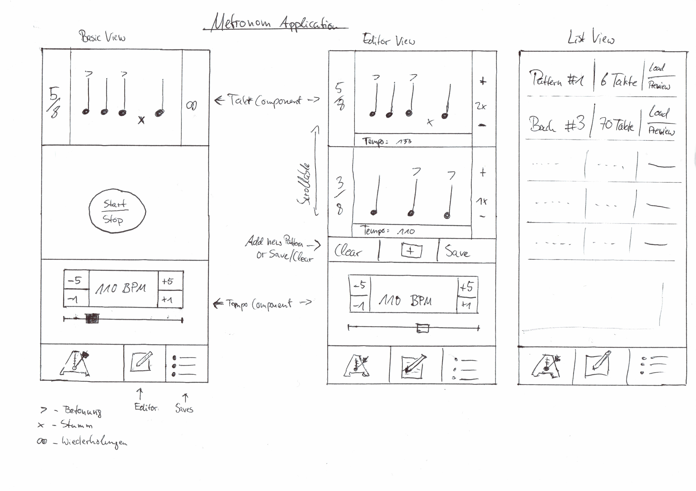

# Metronom Pro

[](https://app.bitrise.io/app/ea70fa64fbda2537)

Semesterprojekt von Bastian Unterbörsch (573228) und Henrik Panhans (573550) für das Modul "Grundlagen Mobiler Anwendungen"

## Grundidee

Wir bauen eine Metronom-App, die zusätzlich zur grundlegenden Takt-Vorgabe-Funktion noch die Möglichkeit bietet, komplexe Muster und Abfolgen von verschiedenen Takten und Tempi zu erstellen und zu speichern.
Diese Taktmuster können außerdem als QR-Code geteilt werden. Der Fokus liegt hierbei auf einer sauberen Trennung der Komponenten und möglischt präziser Zeit-Sychronisation des Metronom-Takts.

## Specs

### Management

Wir haben unsere Issues und Arbeit mit Github Projects gemanaged. Das ist wie eine etwas simplere Version von Jira, was aber für unsere Zwecke völlig ausgereicht hat.
Der Vorteil davon, alles end-to-end über Github zu managen, ist, dass man alles von irgendwo referenzieren und verlinken kann.
Das Einzige, was wir ausgelagert haben, war die CI-Integration. Diese war eher schwierig zu managen über Github Actions und hat nur so zur Hälfte funktioniert. Stattdessen sind wir auf [Bitrise](https://bitrise.io) ausgewichen, was die Einrichtung sehr einfach macht, da die Art des Projekts erkannt wird.
Beispielweise wurden uns direkt zwei Workflows erstellt, einmal `deploy`, der die App baut und die (signierte) APK zu Bitrise Deploy hochläd und zum Anderen `verify`, der zum Beispiel bei PRs getriggert werden kann und dann einen Linter drüber jagt und Unit Tests ausführt. Als Bonus werden die Resultate dann außerdem noch nett visualisiert.

### Views

Die App hat eine Navigation-Bar am unteren Bildschirmrand, über die die folgenden Views errreicht werden können.

#### Basic-Metronom

Diese View bietet einige Buttons zum Einstellen des Takts, Tempo und Betonung/Auslassung. Sobald der "Start"-Button gedrückt wird, spielt das Gerät einen sich wiederholenden Takt ab. Der Button wandelt sich daraufhin in einen Stop-Button um, der das Gegenteil bewirkt. Metronom halt.

#### Pro-Metronom

Das Pro-Metronom bietet die gleichen Funktionen wie das Basic-Metronom, mit dem Unterschied, dass hier nun mehrere, aufeinander folgende Takte und Beat-Muster definiert und angeordnet werden können.
Man kann diese Muster in der Reihenfolge verschieben, duplizieren, löschen oder neu hinzufügen. Es kann außerdem zu jedem Muster eine Wiederholungsanzahl angegeben und angepasst werden.
Über einen Button am oberen Bildschirmrand kann ein Menü angezeigt werden, über welches man entweder das aktuelle Beat-Muster als QR-Code teilen oder es abspeichern kann.

#### Beat-Library

Falls ein Beat-Muster vom Pro-Metronom aus abgespeichert wird, wird es daraufhin in der Beat-Library angezeigt. Von dort aus, kann man Muster antippen, die dann eine nicht-interaktive Vorschau anzeigen.
In dieser kann dann entweder auf "Abbrechen" oder "Laden" gedrückt werden, was zur Folge hat, dass das Pro-Metronom mit dem ausgewählten Muster überschrieben wird.

#### Mockups



#### Integrations-Tests

Da es zu unvorhersehbaren Komplikationen in der Entwicklung kam, hat uns bisher die Zeit nicht gereicht, um auch noch Integrations-Tests zu schreiben. Mit ein wenig mehr Zeit würden wir allerdings Folgendes verifizieren:

- Metronom reagiert korrekt auf Input, d.h.
  - Start/Stop-Button deaktiviert andere Inputs
  - +/- Buttons verändern den jeweiligen Aspekt des Beats korrekt
- Man kann in der Library neue Muster hinzufügen und die `EditorActivity` wird gelauncht
- Swipe-to-delete in der Library funktioniert korrekt
- Ähnlich wie beim Standart-Metronom wäre es beim Editor sinnvoll, alle Inputs zu testen. Wichtiger hierbei wären jedoch neue Beatmuster hinzufügen zu können, Beats löschen zu können und das Playback starten zu können
- Der Flow `App starten` -> `Library öffnen` -> `Neues Muster erstellen` -> `Muster speichern` funktioniert wie gewünscht

## Komponenten (Stand 6. Juni 2022)

Unsere App ist in die folgenden Komponenten unterteilt:


### MetronomeKit

Hier lebt die Logik unserer App. Genauer gesagt liegt der gesamte Code, der nicht direkt mit UI zu tun, das heißt:

#### Audio Package

Das `Audio` Package stellt einige Interfaces bereit, die benötigt werden um mit Audio zu arbeiten und es zu steuern

- `AudioWriteable`: `interface` welches ein Typ implentiert, der Bytes in einen Audio-Kanal schreiben kann
- `StatelessAudioControllable`: `interface` welches ein Typ implementiert, der simple Playback-Kontrolle erlaubt, so wie `play()` und `stop()`
- `AudioControllable`: `interface`-Erweiterung von `StatelessAudioControllable` was ein Property hinzufügt, an dem sich der Playback-Status erkennen lässt

Da dieses Package keinerlei Implementation hat, wird dieses nicht getestet.

#### Beat Package

Im Package `Beat` ist die Logik und die Datenstrukturen für die Beatmuster zu finden. Dies beinhaltet simple `data class` Objekte, die reine Model-Objekte sind und keine Logik beinhalten (außer Validierung). Außerdem ist hier der `BeatManager` zu finden, welches das Singleton-Objekt ist, welches dafür zuständig ist, den nächsten Ton auszusuchen (betont, normal oder muted).

- `Beat`: `data`-Klasse
- `BeatManager`: `object`-Klasse, welches ein `BeatPattern` laden kann und entscheidet welcher Ton des geladenen Musters als nächstes abgespielt werden soll
- `BeatManagerException`: exception, die von `BeatManager` geworfen wird, falls ein Beat-Muster fehlformartiert ist)
- `BeatPattern`: `data`-Klasse. Im Prinzip nur Metadaten und ein Array von `Beat` Objekten
- `Tone`: `enum`

In diesem Package wird vor Allem die doch eher komplexe Logik des `BeatManager` getestet. Bereits vorhandene Tests sind zB:

- simpler 4-Schlag Beat wird einmal wiederholt
- 4-Schlag Beat mit abwechselnd betont und nicht betonten Noten wird einmal wiederholt
- zwei unterschiedliche Beats werden jeweils einmal wiederholt
- simpler 3-Schlag Beat wird zwei Mal wiederholt
- 4-Schlag Beat wird unendlich lang wiederholt
- ungültiger Beat wird erkannt und Exception geworfen

Tests die für die `Beat` Klasse noch geschrieben werden:

- Verifizierung ist korrekt
  - Tempo ist > 0 und liegt im erlaubten Bereich
  - Notenanzahl is > 0 und liegt im erlaubten Bereich
  - Wiederholungen sind entweder `null` oder > 0
  - Betonte und gemutete Noten haben nur Indizes, die auch im Beat existieren können (anhand von Notenanzahl)
- `Tone`-Array wird korrekt ausgegeben
  - richtige Anzahl an Tönen wird zurückgegeben
  - betonte und gemutete Töne sind am richtigen Index zu finden

#### Metronome Package

In diesem Package passiert die meiste Magie. Die folgenden Klassen und Interfaces liegen hier:

- `AudioGapCalculator`: `object class` mit nur einem Zweck, und zwar den Abstand zwischen zwei Schlägen zu errechen, basierent auf der BPM-Zahl und der Länge des abzuspielenden Tons
- `Metronome`: Klasse, die `MetronomeInterface` implementiert, hier wird der eigentliche Ton in den Buffer des `AudioTrack` geschrieben (welcher aber hinter einem weiteren Interface versteckt ist)
- `MetronomeAudioIntercace`: `interface`
- `MetronomeInterface`: `interface` welches ein Typ implentiert, der Metronom-Funktionalität bereitstellt. D.h. zum Beispiel BPM, Sample Rate und Playback-Controls so wie `play()` und `stop()`
- `MetronomeService`: `object`-Klasse, die das erstellte Metronom in der gesamten App als Singleton bereitstellt
- `WrappedAudioTrack`: Klasse, die `MetronomeAudioIntercace` implementier. Im Prinzip nur Wrapper für `AudioTrack`, damit dieser `MetronomeAudioIntercace` implementieren kann

Wir werden uns für dieses Package auf die folgenden Tests konzentrieren:

- `AudioGapCalculator`
  - Errechnete Sound- und Pausenlänge ist korrekt für viele verschieden Eingaben und BPM
- `MetronomeService`
  - Metronom wird korrekt gesteuert und angesprochen (d.h. BPM wird korrekt verändert, `isPlaying`-State ist korrekt, usw.)
- `Metronome`
  - Korrekter Ton wird in richtiger Reihenfolge abgespielt

### MetronomeUI

Dieses Package enhält alle Fragments und ViewModel unserer App, d.h. nur den reinen UI-Code. Nach aktuellem Stand sind dies:

- `EditorViewModel` (gehört zu `EditorActivity`)
- `MetronomeFragment`
- `MetronomeViewModel`

Es sollte klar sein, dass jeweils eine `ViewModel`-Klasse zum gleichnamigen `Fragment` gehört. Was UI-Tests anbelangt, sind wir noch nicht 100% sicher, ob man die Fragments einzeln testen kann oder nur als Teil der gesamten App, das müssen wir noch herausfinden.
Allerdings ändert dies nichts an der Liste der zu testenden Funktionen:

- Metronom
  - BPM lassen sich erfolgreich verändern und dazugehörige `TextView` ändert den Text
  - Start/Stop-Button funktioniert und UI passt sich entsprechend an
  - `BeatView` verändert auch wirklich den zugrunde liegenden Beat
- Editor
  - Es lassen sich erfolgreich Beat-Muster hinzufügen und löschen
  - die jeweiligen `BeatView` verändern den Beat (und nur den richtigen Beat)

### MetronomePro

Hier leben nur die beiden Activities `MainActivity` und `EditorActivity`. Hier wird außerm der Sound des Metronoms geladen und festgelegt und das Metronom mit dem `MetronomeService` verbunden.
Da die `MainActivity` kaum Logik enhält, die nicht vorher schon getestet wurde, oder Boilerplate-Code ist, werden wir keine extra Tests für diese Klasse schreiben.

## Exploration

### Metronom

Im Laufe der bisherigen Entwicklung, gab es vor Allem eine große Frage. Wie kriegen wir es hin, dass das Metronom genau im Takt schlägt? Durch eine Google-Suche ergaben sich schnell 2 potentielle Möglichkeiten, die hier verglichen werden.

#### Thread.sleep

Diese Variante ist die deutlich simplere. Kurz gesagt, muss man den Abstand zwischen zwei Schlägen des Metronoms errechnen und dann `Thread.sleep(timeDelta)` aufrufen, um danach wieder zum Anfang der Schleife zu gelangen.
Der entscheidende Nachteil, der schlussendlich auch dazu geführt hat, dass wir uns gegen diese Methode entschieden haben, ist, dasss `Thread.sleep` nicht garantiert, dass der Thread nach _genau_ dem gewünschten Zeitinterval fortfährt. Das heißt, das potentiel der Beat ein paar Millisekunden länger ist als gewollt, was auf lange Sicht natürlich zu immer gröseren Ungenauigkeiten führt.

#### AudioTrack

Die Verwendung von `AudioTrack` ist deutlich komplexer als `Thread.sleep`. Allerdings bietet sie auch deutlich höhere Präzision, was für ein Metronom natürlich das ausschlaggebende Argument schlechthin ist.
Bei dieser Methode wird eine Instanz von `AudioTrack` konfiguriert und dann kann in diesen sozusagen "live" der Buffer des Lautsprechers gefüllt werden. `AudioTrack` bietet außerdem einen Streaming-Modus, wo die Method `audioTrack.write(byte[] samples)` erst dann returned, wenn die geschriebenen Samples abgespielt wurden.
Das führt dazu, dass wir die Zeitsynchronisation zwischen den Takten quasi umsonst bekommen.

### Persistenz

Bei der Frage wie wir die erstellten Beat-Muster speichern wollen, sind wir uns nach wie vor nicht 100% sicher. Unsere erste Idee war das Ganze einfach in JSON zu encoden und dann in eine Datei auf dem Gerät zu schreiben, und andersrum natürlich wieder zu laden. Dies würde allerdings einiges an manueller Arbeit mit ByteStreams usw. erfordern, was fehleranfällig ist.
Einfacher (und vermutlich auch deutlich sicherer) wäre es eine lokale NoSQL Datenbank wie zum Beispiel MongoDB aufzuziehen, was wir wahrscheinlich schlussendlich auch tun werden. Hier nimmt uns die Datenbank einiges an Arbeit, wie zum Beispiel `fetchAll`, `delete` und so weiter.

Die gespeicherten Beat-Muster könnten in JSON ungefähr wie folgt aussehen:

```jsonc
{
  "patternName": "Some Beat Pattern", // name of pattern
  "createdAt": "2022-05-08 15:26:01+1000", // date of creation
  "patterns": [
    {
      "tempo": 120, // range(10-300)
      "noteCount": 3, // range(1-12)
      "repetitions": 3, // range(1-10)
      "emphasisedNotes": [0, 1] // first and second note emphasised; optional
    },
    {
      "tempo": 140,
      "noteCount": 4,
      "repetitions": 2,
      "emphasisedNotes": [1, 3], // second and fourth note emphasised
      "mutedNotes": [2] // 3 note muted; optional
    }
  ]
}
```

Update 12.07.2022:

Es stellte sich heraus, dass man auf Android tatsächlich keine lokale (oder remote) MongoDB Datenbank benutzen kann. Man müsste ein eigenes Backend schreiben, welches dann unter der Haube mit Mongo kommuniziert.
Da hierfür die Zeit nicht ausreicht (und es uns den Aufwand nicht wert war), entschieden wir uns doch für eine Standart Room-Datenbank. Dies ist eine SQL-Datenbank, von Android direkt als Package bereitgestellt (heißt, dass es viel Dokumentation und Beispiele gibt).
Das einzige Problem hierbei war es, den Array an `Beat` irgendwie in eine Column zu quetschen. Auch hier sind wir den "Path of least resistence" gegangen und haben einfach `kotlinx-serialization` genutzt, um den Array in einen JSON-String zu konvertieren, den man dann ohne Probleme in eine SQL-Spalte speichern kann. Nicht schön, aber es funktioniert
